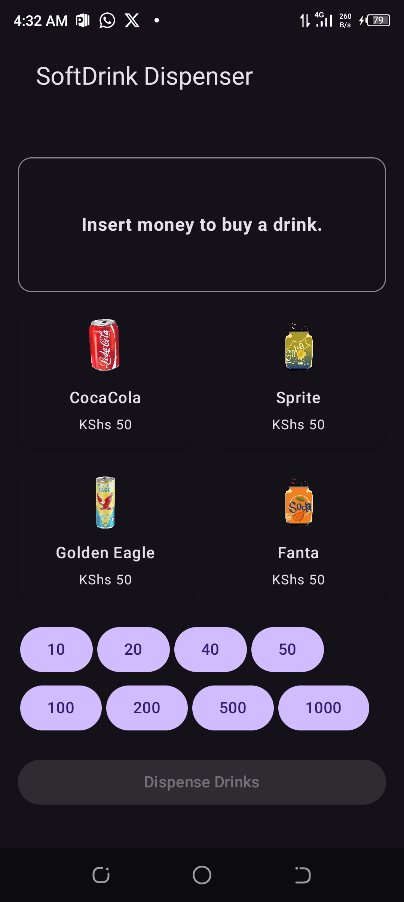

# JKUAT Soft Drink Vending Machine App

 

An Android app that simulates a soft drink vending machine at JKUAT cafeteria, allowing users to purchase drinks by inserting virtual coins/notes and receiving change.

## Features

- 💰 Accepts multiple currency denominations:
  - Coins: KShs 10, 20, 40
  - Notes: KShs 50, 100, 200, 500, 1000
- 🥤 Allows purchase of multiple drinks (KShs 50 each)
- 🔄 Automatically calculates and dispenses correct change
- 📱 Intuitive UI with:
  - Product selection grid
  - Currency insertion buttons
  - Transaction messages
  - Balance display

## How It Works

1. **Insert Money**:
   - Tap currency buttons to add money
   - Minimum KShs 50 required to purchase drinks

2. **Select Drinks**:
   - Choose from available soft drinks
   - Each drink deducts KShs 50 from your balance
   - Purchase multiple drinks while you have sufficient balance

3. **Complete Transaction**:
   - Dispense drinks with the "Dispense Drinks" button
   - Receive any remaining change
   - Transaction summary displayed

## Technical Implementation

- Built with **Jetpack Compose** for modern UI
- State management with `mutableStateOf`
- Clean architecture with:
  - Composable UI components
  - State hoisting pattern
  - Separation of concerns

### Key Components

- `VendingMachineScreen`: Main screen with all functionality
- `ProductGrid`: Displays available drinks
- `CurrencyButtons`: Money insertion interface
- `TransactionCard`: Shows messages and balance

## Installation

1. Clone the repository:
   ```bash
   git clone git@github.com:Allanvince/Vending-Machine.git
